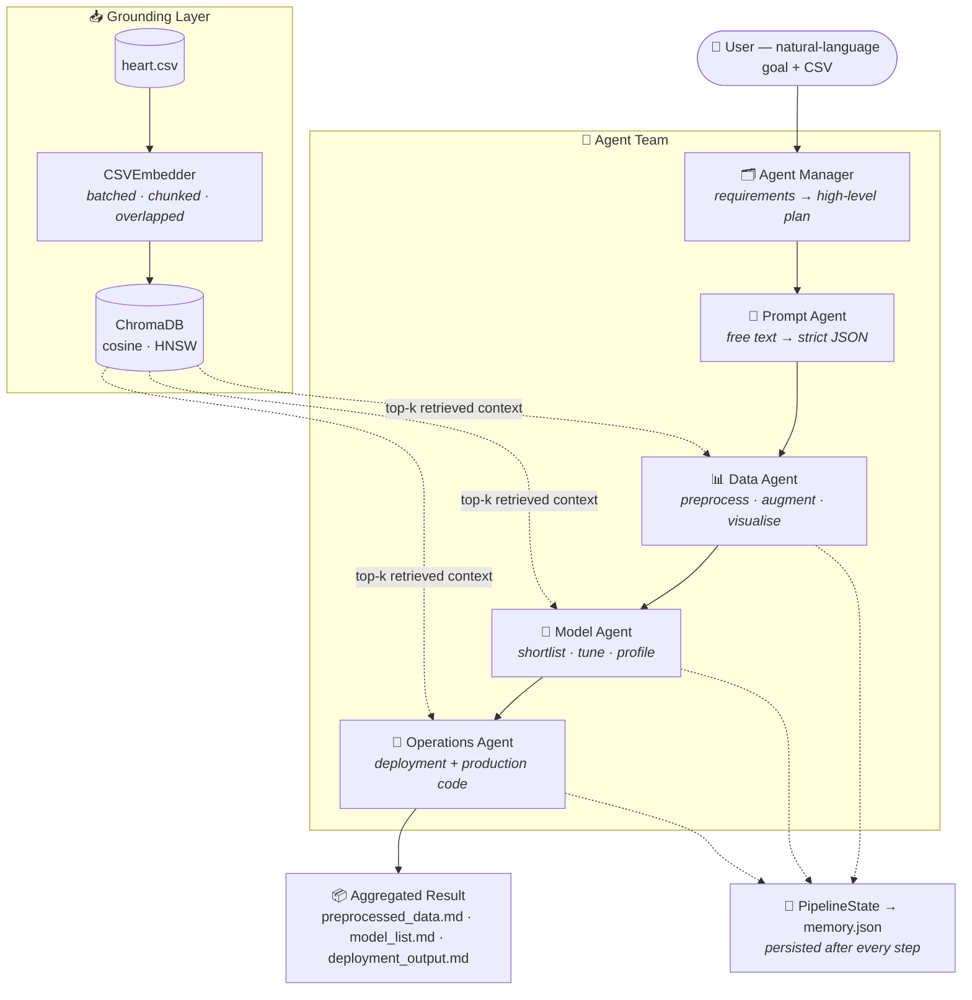

<h1 align="center">🤖 AutoML-Agent</h1>
<p align="center">
  <b>A multi-agent LLM framework that turns a plain-English request into a full machine learning pipeline.</b><br>
  <sub>Data preprocessing → model selection → hyperparameter strategy → deployment plan — orchestrated by five specialised agents.</sub>
</p>

<p align="center">
  
  
  
  
  
  
  
</p>

---

## 💡 The Problem

Building an ML solution means repeating the same expensive loop: understand the data, clean it, shortlist models, tune them, then ship. Most of that work is **judgement encoded as boilerplate** — exactly the kind of work an LLM can reason about, if you give it structure, memory, and a clear division of labour.

**AutoML-Agent** provides that structure. You describe your goal in one sentence and hand it a CSV; a team of role-specialised LLM agents collaborates through a stateful pipeline to produce a preprocessing strategy, a ranked model shortlist, and a deployment plan — each step grounded in the *actual contents* of your dataset via retrieval.

> Implementation of the architecture proposed in [**AutoML-Agent: A Multi-Agent LLM Framework for Full-Pipeline AutoML**](https://arxiv.org/abs/2410.02958) (arXiv:2410.02958), built from scratch on open-weights models rather than proprietary APIs.

---

## ✨ What Makes This Interesting

| | |
|---|---|
| 🧠 **Role-specialised agent team** | Five agents — Manager, Prompt, Data, Model, Operations — each with a purpose-built system prompt modelled on a real ML team: PM, data scientist, ML researcher, MLOps engineer. |
| 🔍 **RAG-grounded, not hallucinated** | Every CSV row is embedded with `thenlper/gte-small` into a persistent **ChromaDB** collection (cosine similarity, HNSW index). Agents retrieve the top-*k* most relevant records, so recommendations are grounded in real data rather than guesses. |
| ⚡ **Fully asynchronous** | Blocking LLM calls and CPU-bound embedding work are dispatched via `asyncio.to_thread`, keeping the event loop free — the pipeline handles long-running multi-agent runs without stalling. |
| 💾 **Stateful, auditable workflow** | A dedicated `PipelineState` object tracks phase, step, and per-agent memory, persisting to JSON after **every** agent hand-off — so a run is inspectable, not a black box. |
| 🧩 **Factory-based agent registry** | Agents are declared once in an `agent_factory` and injected into the orchestrator. Swapping a model (Llama 3.3 70B → Mixtral → Gemma 2) or adding a sixth agent is a config change, not a refactor. |
| 💸 **No proprietary dependencies** | Runs entirely on open-weights models served through Groq's LPU inference — no OpenAI key required. |

---

## 🏗️ Architecture



### The Agents

| Agent | Role modelled | Responsibility |
|---|---|---|
| **Agent Manager** | Senior Project Manager | Ingests user requirements as structured JSON and devises the high-level plan the rest of the team executes. |
| **Prompt Agent** | Assistant PM | Converts free-form instructions into schema-conformant JSON, giving the pipeline a machine-parsable contract with the user. |
| **Data Agent** | Data Scientist | Dataset retrieval, preprocessing strategy, augmentation, and exploratory insight generation. |
| **Model Agent** | ML Research Engineer | Ranks candidate models for the task, proposes hyperparameter tuning strategies, and profiles trade-offs. |
| **Operations Agent** | MLOps Engineer | Produces the end-to-end deployment path and production-level Python implementation. |

---

## 🛠️ Tech Stack

| Layer | Choice |
|---|---|
| **Language & runtime** | Python 3.10, `asyncio` |
| **LLM inference** | Groq API — `llama-3.3-70b-versatile` (also configured: Llama 3.1 8B, Mixtral 8x7B, Gemma 2 9B) |
| **Retrieval** | ChromaDB (persistent client, LRU segment cache) |
| **Embeddings** | Sentence-Transformers — `thenlper/gte-small` |
| **Data handling** | pandas |
| **Interface** | Streamlit dashboard + CLI entry point |
| **Packaging** | `setup.py`, `tox.ini`, `setup.cfg` |

---

## 🚀 Quickstart

### Prerequisites
- Python **3.10** (Conda recommended)
- A free [Groq API key](https://console.groq.com/)

### 1 · Clone and set up the environment
```bash
git clone https://github.com/HakimOwais/AutoML-Multi-Agent.git
cd AutoML-Multi-Agent

conda create -n automl-agent python=3.10 -y
conda activate automl-agent
pip install -r requirements.txt
```

### 2 · Add your credentials
Create a `.env` file in the project root:
```env
GROQ_API_KEY="your_groq_api_key_here"
```

### 3 · Point it at a dataset
Drop your CSV into [data/](data/) and update the path in [main.py](main.py). A sample UCI heart-disease dataset ships with the repo:
```python
await csv_embedder.embed_csv("data/heart.csv")
```

### 4 · Run the pipeline
```bash
python main.py
```

The agents collaborate in sequence and write their artefacts to `data/` and `output/MyOutput/Model_Development/`.

### Or use the Streamlit dashboard
```bash
streamlit run streamlit_demo.py
```
Upload a CSV, describe your goal in the text boxes, and watch the pipeline execute.

---

## 🎯 Example Run

**Input** — three sentences of plain English:
```text
Preprocessing : "I have uploaded the dataset obtained from UCI Machine Learning, which relates
                 to detecting heart disease in patients based on various patient features.
                 Develop a model with at least 90 percent accuracy."
Model request : "Find the top 3 models for classifying this dataset."
Deployment    : "Deploy the selected model as a web application."
```

**Output** — three markdown artefacts plus a persisted memory trace:

```
data/
├── preprocessed_data.md    # cleaning strategy, feature handling, EDA insights
├── model_list.md           # ranked model shortlist with justification
└── deployment_output.md    # deployment architecture + production code
output/MyOutput/Model_Development/
├── memory.json             # full per-agent audit trail
└── final_state.md
```

Outputs from real runs are committed under [data/](data/) and [output/](output/), so you can see exactly what the framework produces before running it yourself.

---

## 📂 Project Structure

```
AutoML-Multi-Agent/
├── main.py                        # CLI entry point — wires state, embedder, and pipeline
├── streamlit_demo.py              # Streamlit dashboard
├── source/
│   ├── agents/
│   │   ├── multi_agents.py        # The five agent classes
│   │   ├── agent_factory.py       # Declarative agent registry & model config
│   │   └── pipeline_agent.py      # Orchestrator: retrieval → data → model → deploy
│   ├── models/llm.py              # Async Groq client wrapper (ModelAgentBase)
│   ├── prompts/agent_prompts.py   # Role-specific system prompts
│   ├── embedding_manager.py       # CSVEmbedder: chunking, batching, ChromaDB I/O
│   ├── pipeline_state.py          # Phase / step / memory tracking + persistence
│   ├── schema.py                  # JSON contract between user and pipeline
│   ├── utils.py                   # Overlapping text chunker
│   ├── custom_logging.py
│   └── custom_exception.py
├── application/api.py             # 🚧 REST interface (planned)
├── data/                          # Datasets, ChromaDB store, sample outputs
└── output/                        # Persisted pipeline state per run
```

---

## 🗺️ Roadmap

- [ ] **FastAPI service layer** in `application/api.py` — expose the pipeline as a REST endpoint
- [ ] **Executable code generation** — run and validate the agent-produced training code, not just emit it
- [ ] **Feedback loop** — let the Model Agent iterate on real metrics until the accuracy target is met
- [ ] **Tool-calling** for the Model Agent (`source/tools/ml_tools.py`) so it can fit models directly
- [ ] **Multi-format ingestion** beyond CSV (Parquet, SQL, JSON)
- [ ] **Test suite** with `pytest` plus CI via GitHub Actions
- [ ] **Containerisation** with Docker for reproducible deployment

---

## 🧑‍💻 What I Learned Building This

- Designing **multi-agent orchestration** where state and context must survive across independent LLM calls — and why persisting memory at every hand-off matters for debuggability.
- Making **RAG useful for tabular data**: row-level embedding, overlap-aware chunking, and batched vector writes so retrieval stays fast as CSVs grow.
- Keeping a **synchronous SDK non-blocking** by isolating I/O and CPU work behind `asyncio.to_thread` in one reusable base class.
- Treating **prompts as an interface**: a strict JSON schema between agents turns a chain of chatty LLMs into a system with contracts.

---

## 🤝 Contributing

Contributions are very welcome — the roadmap above is a good place to start.

1. Fork the repository
2. Create a feature branch (`git checkout -b feature/your-feature`)
3. Commit your changes
4. Push and open a pull request

---

## 🙏 Acknowledgments

- **Research inspiration:** [AutoML-Agent: A Multi-Agent LLM Framework for Full-Pipeline AutoML](https://arxiv.org/abs/2410.02958)
- **Dataset:** UCI Machine Learning Repository — Heart Disease
- The open-source ecosystem that makes this possible: Groq, Meta Llama, ChromaDB, Sentence-Transformers, Streamlit

---

## 📄 License

Licensed under the Apache License 2.0 — see [LICENSE](LICENSE).

---

<p align="center">
  <b>Built by Owais Hakim</b><br>
  <a href="https://github.com/HakimOwais">GitHub</a> · <a href="mailto:owaisibnmushtaq@gmail.com">Email</a><br>
  <sub>⭐ If this project interests you, a star is always appreciated.</sub>
</p>
